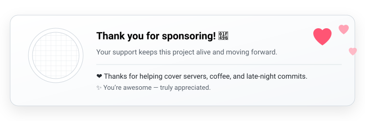

# Mosona Manager

English | [Español](./README_es.md) | [简体中文](./README_zh_cn.md)

  
  

 

Designed as a team-oriented / personal project management server monitor and terminal management tool, featuring comprehensive project permission control and Agent & SSH-driven remote management protocol.

## Features
- **Project Management**: Create and manage multiple projects with ease.
- **User Permissions**: Assign and control user permissions for each project.
- **SSH Remote Management**: Securely manage servers and terminals via SSH.
- **Flexible Connection Modes**: Support both agent-based and agentless connection methods.
- **Real-time Monitoring**: Monitor server performance and project status in real-time.
- **Notifications**: Receive alerts and notifications for important events.
- **Web Interface**: User-friendly web interface for easy navigation and management.
- **API Access**: RESTful API for integration with other tools and services.
- **Logging and Auditing**: Keep track of all actions and changes within the system.
- **Public Page**: Share real-time system status with a customizable public-facing dashboard.

## Connection Modes

### Agentless Mode

> This is an active (forward) connection. The managed server must be exposed so that it can be connected by the Hub. In a public network environment, the managed server must have a public IP address.

No need to install any agents on the managed servers, simplifying deployment and reducing overhead.

### Agent Mode (A/P)

Optional lightweight agents can be deployed on managed servers. The Agent reports its status to the central server, or the central server queries the Agent for status.

#### 1. Active Mode

It is also an active (forward) connection, as detailed above.

#### 2. Passive Mode

This is a passive (reverse) connection. The Hub must be exposed so that it can be connected by the Agent. In a public network environment, the Hub must have a public IP address.

## Get started & Deploy

> In progress

~~Please refer to the [Quickstart (Docs)](https://manager.mosona.cc/quickstart) for detailed instructions on installation and configuration.~~

## Screenshots

| Home | Terminal |
|---|---|
|  |  |

| New Serevr | Monitor |
|---|---|
|  |  |

| Public Page (M) | Public Page |
|---|---|
|  |  |

| Profile | Admin |
|---|---|
|  |  |

## Changelog

See [CHANGELOG.md](./CHANGELOG.md) for history of changes.

## Community

- [Discord](https://discord.gg/gmWzrXFXsB)
- [GitHub Discussions](https://github.com/mosona-labs/mosona-manager/discussions)

## Sponsors

If you find Mosona Manager helpful and would like to support its development, consider becoming a sponsor. 

- [GitHub Sponsors](https://github.com/sponsors/arsfy)

Your support helps us maintain and improve the project.

This project is made possible thanks to the support of the following sponsors.

<table>
  <tr>
    <td align="center"><a href="https://github.com/Asahina1096"> Asahina1096</a></td>
  </tr>
</table>

## License

This project is licensed under the MIT License. See the [LICENSE](./LICENSE) file for details.
